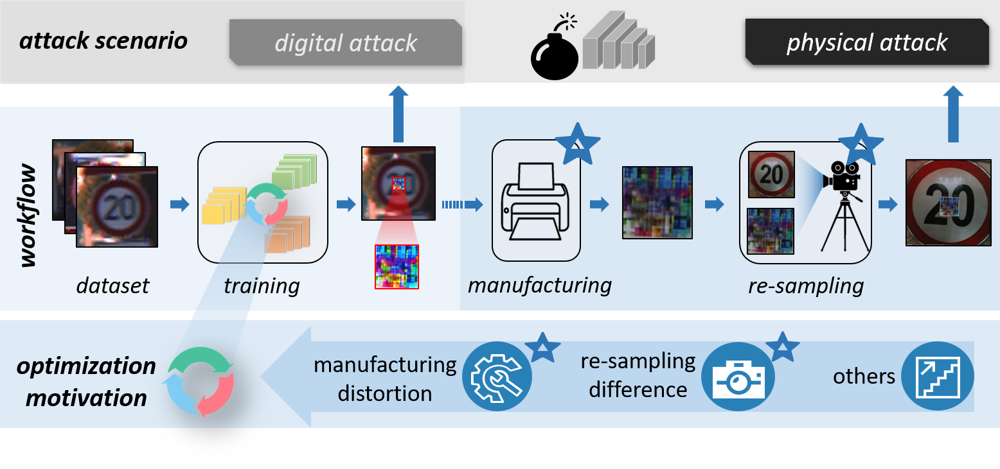

# Awesome Physical Adversarial Examples 
This repo collects papers about **Physical Adversarial Examples** for anyone who wants to do research on it. We are continuously improving the project. Welcome to PR the works (papers, repositories) that are missed by the repo. Special thanks to the [**Researchers**](#Contributors) who have contributed to this project!

## The Differences between Digital and Physical Adversarial Examples

## The Route Map of Recent Physical Adversarial Examples

## The Category Tree of Physical Adversarial Attacks and Defenses

  

## Table of Contents

- [Surveys](#Surveys)
- [Papers-Physical Adversarial Attacks](#Papers-Physical-Adversarial-Attacks)
  - [Manufacturing Oriented Attacks](#Manufacturing-Oriented-Attacks)
    - [Touchable Attacks](#Touchable-Attacks)
    - [Untouchable Attacks](#Untouchable-Attacks)
  - [Resampling Oriented Attacks](#Resampling-Oriented-Attacks)
    - [Environment-oriented Attacks](#Environment-oriented-Attacks)
    - [Sampler-oriented Attacks](#Sampler-oriented-Attacks)
  - [Other PAEs](#Other-PAEs)
    - [The Natural Physical Adversarial Attacks](#The-Natural-Physical-Adversarial-Attacks)
    - [The Transferable Physical Adversarial Attacks](#The-Transferable-Physical-Adversarial-Attacks)
    - [The Generalized Physical Adversarial Attacks](#The-Generalized-Physical-Adversarial-Attacks)
- [Papers-Adversarial Defense Methods](#Papers-Adversarial-Defense-Methods)
  - [Data-end Defense](#Data-end-Defense)
    - [Adversarial Detecting](#Adversarial-Detecting)
    - [Adversarial Denoising](#Adversarial-Denoising)
    - [Adversarial Prompting](#Adversarial-Prompting)
  - [Model-end Defense](#Model-end-Defense)
    - [Adversarial Training](#Adversarial-Training)
    - [Model Modification](#Model-Modification)
    - [Certified Robustness](#Certified-Robustness)
- [Our\_Team](#our_team)
  - [Current Members](#current-members)
  - [Alumnus](#alumnus)
- [Collaborators](#collaborators)
- [Contributors](#contributors)

[:fire:] *indicates citation number*, *and* [⭐] *indicates Github star number*.   

## Surveys

- \[**`2023`**\][[CoRR](https://arxiv.org/pdf/2211.01671.pdf)] Physically adversarial attacks and defenses in computer vision: A survey
- \[**`2023`**\][[arXiv](https://arxiv.org/pdf/2209.14262.pdf)] A survey on physical adversarial attack in computer vision
- \[**`2023`**\][[arXiv](https://arxiv.org/pdf/2209.15179.pdf)] Physical adversarial attack meets computer vision: A decade survey
- \[**`2021`**\]\[[IJMLC](https://link.springer.com/article/10.1007/s13042-020-01242-z)\][77:fire:] Adversarial examples: attacks and defenses in the physical world
- \[**`2021`**\]\[[IEEE Access](https://ieeexplore.ieee.org/document/9614158)\][132:fire:] Advances in adversarial attacks and defenses in computer vision: A survey
- \[**`2018`**\]\[[cybersecurity](https://cybersecurity.springeropen.com/articles/10.1186/s42400-018-0012-9)\][44:fire:] A survey of practical adversarial example attacks

## Papers-Physical Adversarial Attacks

### Manufacturing Oriented Attacks

#### Touchable Attacks

- \[**`2023`**\][[CVPR](https://openaccess.thecvf.com/content/CVPR2023/papers/Wei_Physically_Adversarial_Infrared_Patches_With_Learnable_Shapes_and_Locations_CVPR_2023_paper.pdf)] Physically adversarial infrared patches with learnable shapes and locations [**`2D`**]
- \[**`2023`**\][[AAAI](https://arxiv.org/pdf/2212.05709.pdf)] Hotcold block: Fooling thermal infrared detectors with a novel wearable design \[**`2D`**\][[Code](https://github.com/weihui1308/HOTCOLDBlock)]
- \[**`2023`**\][[USENIX Security Symposium](https://arxiv.org/pdf/2302.09491.pdf)] X-Adv: Physical Adversarial Object Attacks against X-ray Prohibited Item Detections \[**`3D`**\][[Code](https://github.com/DIG-Beihang/X-adv)]
- \[**`2023`**\][[CVPR](https://openaccess.thecvf.com/content/CVPR2023/papers/Yang_Towards_Effective_Adversarial_Textured_3D_Meshes_on_Physical_Face_Recognition_CVPR_2023_paper.pdf)] Towards Effective Adversarial Textured 3D Meshes on Physical Face Recognition \[**`3D`**\][[Code](https://github.com/thu-ml/AT3D)]
- \[**`2023`**\][[CVPR](https://openaccess.thecvf.com/content/CVPR2023/papers/Hu_Physically_Realizable_Natural-Looking_Clothing_Textures_Evade_Person_Detectors_via_3D_CVPR_2023_paper.pdf)] Physically Realizable Natural-Looking Clothing Textures Evade Person Detectors via 3D Modeling \[**`3D`**\][[Code](https://github.com/WhoTHU/Adversarial_camou)]
- \[**`2023`**\][[PR](https://www.sciencedirect.com/science/article/pii/S003132032300136X)] Boosting transferability of physical attack against detectors by redistributing separable attention \[**`3D`**\][[Code](https://github.com/zhangyu13a/transPhyAtt)]
- \[**`2022`**\][[TPAMI](https://arxiv.org/pdf/2212.12995.pdf)] Simultaneously optimizing perturbations and positions for black-box adversarial patch attacks \[**`2D`**\][[Code](https://github.com/shighghyujie/newpatch-rl)]
- \[**`2022`**\]\[[TPAMI](https://ieeexplore.ieee.org/abstract/document/9779913)\][44:fire:] Adversarial Sticker: A Stealthy Attack Method in the Physical World \[**`2D`**\][[Code](https://github.com/jinyugy21/Adv-Stickers_RHDE)]
- \[**`2022`**\][[CVPR](https://openaccess.thecvf.com/content/CVPR2022/papers/Suryanto_DTA_Physical_Camouflage_Attacks_Using_Differentiable_Transformation_Network_CVPR_2022_paper.pdf)] Dta: Physical camouflage attacks using differentiable transformation network \[**`3D`**\][[Code](https://github.com/difftransattack/dta)]
- \[**`2022`**\][[NIPS](https://arxiv.org/pdf/2210.15291.pdf)] Isometric 3D Adversarial Examples in the Physical World [**`3D`**]
- \[**`2022`**\]\[[AAAI](https://arxiv.org/pdf/2109.07193.pdf)\] FCA: Learning a 3D Full-coverage Vehicle Camouflage for Multi-view Physical Adversarial Attack \[**`3D`**\][[Code](https://github.com/winterwindwang/Full-coverage-camouflage-adversarial-attack)]
- \[**`2021`**\]\[[TCYB](https://arxiv.org/pdf/1902.02067.pdf)\][81:fire:] Daedalus: Breaking Non-Maximum Suppression in Object Detection via Adversarial Examples \[**`2D`**\][[Code](https://github.com/NeuralSec/Daedalus-attack)]
- \[**`2021`**\]\[[CVPR](https://openaccess.thecvf.com/content/CVPR2021/papers/Wang_Dual_Attention_Suppression_Attack_Generate_Adversarial_Camouflage_in_Physical_World_CVPR_2021_paper.pdf)\][97:fire:] Dual Attention Suppression Attack: Generate Adversarial Camouflage in Physical World \[**`3D`**\][[Code](https://github.com/nlsde-safety-team/DualAttentionAttack)]\[42:star:\]
- \[**`2020`**\]\[[CVPR](https://openaccess.thecvf.com/content_CVPR_2020/papers/Huang_Universal_Physical_Camouflage_Attacks_on_Object_Detectors_CVPR_2020_paper.pdf)\][143:fire:] Universal Physical Camouflage Attacks on Object Detectors \[**`3D`**\][[Code](https://github.com/mesunhlf/UPC-tf)]
- \[**`2020`**\]\[[CVPR](https://openaccess.thecvf.com/content_CVPR_2020/papers/Tu_Physically_Realizable_Adversarial_Examples_for_LiDAR_Object_Detection_CVPR_2020_paper.pdf)\][169:fire:] Physically Realizable Adversarial Examples for LiDAR Object Detection [**`3D`**]
- \[**`2020`**\]\[[ECCV](https://arxiv.org/pdf/1910.11099.pdf)\][264:fire:] Adversarial T-shirt! Evading Person Detectors in A Physical World [**`3D`**]
- \[**`2019`**\]\[[ACM TOPS](https://arxiv.org/pdf/1801.00349.pdf)\][158:fire:] A General Framework for Adversarial Examples with Objectives \[**`2D`**\][[Code](https://github.com/mahmoods01/agns)]
- \[**`2019`**\]\[[CVPR Workshop](https://openaccess.thecvf.com/content_CVPRW_2019/papers/CV-COPS/Thys_Fooling_Automated_Surveillance_Cameras_Adversarial_Patches_to_Attack_Person_Detection_CVPRW_2019_paper.pdf)\][504:fire:] Fooling automated surveillance cameras: adversarial patches to attack person detection \[**`2D`**\][[Code](https://gitlab.com/EAVISE/adversarial-yolo)]\[98:star:\]
- \[**`2019`**\]\[[ICML Workshop](https://arxiv.org/pdf/1906.11897.pdf)\][137:fire:] On Physical Adversarial Patches for Object Detection \[**`2D`**\][[Code](https://github.com/erasaur/adversarial-patch-object-detection)]
- \[**`2019`**\]\[[CVPR](https://openaccess.thecvf.com/content_CVPR_2019/papers/Xiao_MeshAdv_Adversarial_Meshes_for_Visual_Recognition_CVPR_2019_paper.pdf)\][102:fire:] MeshAdv: Adversarial Meshes for Visual Recognition [**`3D`**]
- \[**`2018`**\][[USENIX Workshop](https://arxiv.org/pdf/1807.07769.pdf)\][436:fire:] Physical Adversarial Examples for Object Detectors [**`2D`**]
- \[**`2018`**\]\[[CVPR](https://openaccess.thecvf.com/content_cvpr_2018/papers/Eykholt_Robust_Physical-World_Attacks_CVPR_2018_paper.pdf)\][2142:fire:] Robust Physical-World Attacks on Deep Learning Visual Classification [**`2D`**]
- \[**`2018`**\][[ICLR](https://arxiv.org/pdf/1607.02533.pdf)\][5492:fire:] Adversarial examples in the physical world [**`2D`**]
- \[**`2018`**\]\[[ICML](https://arxiv.org/pdf/1707.07397.pdf)\][1608:fire:] Synthesizing Robust Adversarial Examples \[**`3D`**\][[Code](https://github.com/prabhant/synthesizing-robust-adversarial-examples)]\[63:star:\]
- \[**`2017`**\][[arXiv](https://arxiv.org/pdf/1712.02494.pdf)\][132:fire:] Adversarial Examples that Fool Detectors [**`2D`**]
- \[**`2016`**\][[ACM CCS](https://dl.acm.org/doi/10.1145/2976749.2978392)\][1638:fire:] Accessorize to a Crime: Real and Stealthy Attacks on State-of-the-Art Face Recognition [**`2D`**]

#### Untouchable Attacks

- \[**`2023`**\][[ICCV](https://arxiv.org/pdf/2307.07653.pdf)] RFLA: A Stealthy Reflected Light Adversarial Attack in the Physical World \[**`Lighting`**\][[Code](https://github.com/winterwindwang/RFLA)]
- \[**`2023`**\][[CVPR](https://openaccess.thecvf.com/content/CVPR2023/papers/Li_Physical-World_Optical_Adversarial_Attacks_on_3D_Face_Recognition_CVPR_2023_paper.pdf)] Physical-world optical adversarial attacks on 3d face recognition [**`Lighting`**]
- \[**`2022`**\]\[[CVPR](https://openaccess.thecvf.com/content/CVPR2022/papers/Zhong_Shadows_Can_Be_Dangerous_Stealthy_and_Effective_Physical-World_Adversarial_Attack_CVPR_2022_paper.pdf)\][65:fire:] Shadows can be dangerous: Stealthy and effective physical-world adversarial attack by natural phenomenon \[**`Lighting`**\][[Code](https://github.com/hncszyq/ShadowAttack)]
- \[**`2022`**\][[arXiv](https://arxiv.org/pdf/2209.02430.pdf)] Adversarial color film: Effective physical-world attack to dnns [**`Lighting`**]
- \[**`2022`**\][[arXiv](https://arxiv.org/pdf/2206.12251.pdf)] Adversarial Zoom Lens: A Novel Physical-World Attack to DNNs [**`Lighting`**]
- \[**`2022`**\][[VR](https://arxiv.org/pdf/2012.05858.pdf)] SPAA: Stealthy Projector-based Adversarial Attacks on Deep Image Classifiers \[**`Lighting`**\][[Code](https://github.com/BingyaoHuang/SPAA)]
- \[**`2022`**\][[WACV](https://arxiv.org/pdf/2110.11525.pdf)] Digital and Physical-World Attacks on Remote Pulse Detection [**`Lighting`**]
- \[**`2022`**\][[ICLR](https://arxiv.org/pdf/2112.07076.pdf)] Real-time neural voice camouflage \[**`Audio/Speech`**\][[Code](https://github.com/cvlab-columbia/voicecamo)]
- \[**`2022`**\][[NIPS](https://papers.nips.cc/paper_files/paper/2022/file/c204d12afa0175285e5aac65188808b4-Paper-Conference.pdf)] VoiceBlock: Privacy through Real-Time Adversarial Attacks with Audio-to-Audio Models \[**`Audio/Speech`**\][[Code](https://github.com/voiceboxneurips/voicebox)]
- \[**`2021`**\]\[[USENIX Security Symposium](https://arxiv.org/pdf/2007.04137.pdf)\][55:fire:] SLAP: Improving Physical Adversarial Examples with Short-Lived Adversarial Perturbations \[**`Lighting`**\][[Code](https://github.com/ssloxford/short-lived-adversarial-perturbations)]
- \[**`2021`**\][[ICCV Workshop](https://arxiv.org/pdf/2108.06247.pdf)] Optical Adversarial Attack [**`Lighting`**]
- \[**`2021`**\][[CVPR](https://openaccess.thecvf.com/content/CVPR2021/papers/Pony_Over-the-Air_Adversarial_Flickering_Attacks_Against_Video_Recognition_Networks_CVPR_2021_paper.pdf)] Over-the-Air Adversarial Flickering Attacks against Video Recognition Networks [**`Lighting`**]
- \[**`2021`**\]\[[CVPR](https://openaccess.thecvf.com/content/CVPR2021/papers/Duan_Adversarial_Laser_Beam_Effective_Physical-World_Attack_to_DNNs_in_a_CVPR_2021_paper.pdf)\][77:fire:] Adversarial Laser Beam: Effective Physical-World Attack to DNNs in a Blink \[**`Lighting`**\][[Code](https://github.com/RjDuan/Advlight)]
- \[**`2021`**\][[AAAI](https://arxiv.org/pdf/2101.08154.pdf)] Fooling thermal infrared pedestrian detectors in real world using small bulbs [**`Lighting`**]
- \[**`2021`**\]\[[CVPR](https://openaccess.thecvf.com/content/CVPR2021/papers/Sayles_Invisible_Perturbations_Physical_Adversarial_Examples_Exploiting_the_Rolling_Shutter_Effect_CVPR_2021_paper.pdf)\][53:fire:] Invisible Perturbations: Physical Adversarial Examples Exploiting the Rolling Shutter Effect \[**`Lighting`**\][[Code](https://github.com/earlence-security/invis-perturbations)]
- \[**`2021`**\][[arXiv](https://arxiv.org/pdf/2106.09908.pdf)] Light Lies: Optical Adversarial Attack [**`Lighting`**]
- \[**`2021`**\][[ICASSP](https://arxiv.org/pdf/2105.09022.pdf)] Attack on practical speaker verification system using universal adversarial perturbations \[**`Audio/Speech`**\][[Code](https://github.com/zhang-wy15/Attack_practical_asv)]
- \[**`2020`**\]\[[NIPS](https://arxiv.org/pdf/2002.03500.pdf)\][55:fire:] Watch out! Motion is Blurring the Vision of Your Deep Neural Networks \[**`Lighting`**\][[Code](https://github.com/tsingqguo/ABBA)]
- \[**`2020`**\]\[[USENIX Security Symposium](https://arxiv.org/pdf/2006.11946.pdf)\][164:fire:] Light Commands: Laser-Based Audio Injection Attacks on Voice-Controllable Systems [**`Audio/Speech`**]
- \[**`2020`**\]\[[ICASSP](https://arxiv.org/pdf/2003.02301.pdf)\][86:fire:] Real-time, Universal, and Robust Adversarial Attacks Against Speaker Recognition Systems [**`Audio/Speech`**]
- \[**`2020`**\]\[[HotMobile](https://dl.acm.org/doi/abs/10.1145/3376897.3377856)\][72:fire:] Practical Adversarial Attacks Against Speaker Recognition Systems [**`Audio/Speech`**]
- \[**`2020`**\]\[[USENIX Security Symposium](https://www.usenix.org/system/files/sec20summer_chen-yuxuan_prepub.pdf)\][116:fire:] Devil’s Whisper: A General Approach for Physical Adversarial Attacks against Commercial Black-box Speech Recognition Devices \[**`Audio/Speech`**\][[Code](https://github.com/RiskySignal/Devil-Whisper-Attack)]
- \[**`2019`**\][[S&P](https://www.ieee-security.org/TC/SP2019/posters/hotcrp_sp19posters-final28.pdf)] Poster: Perceived Adversarial Examples [**`Lighting`**]
- \[**`2019`**\]\[[NIPS](https://arxiv.org/pdf/1911.00126.pdf)\][57:fire:] Adversarial Music: Real World Audio Adversary Against Wake-word Detection System [**`Audio/Speech`**]
- \[**`2019`**\]\[[IJCAI](https://arxiv.org/pdf/1810.11793.pdf)\][194:fire:] Robust Audio Adversarial Example for a Physical Attack \[**`Audio/Speech`**\][[Code](https://github.com/hiromu/robust_audio_ae)]
- \[**`2019`**\]\[[ICML](https://arxiv.org/pdf/1903.10346.pdf)\][397:fire:] Imperceptible, Robust, and Targeted Adversarial Examples for Automatic Speech Recognition \[**`Audio/Speech`**\][[Code](https://github.com/yaq007/cleverhans/tree/master/examples/adversarial_asr)]
- \[**`2019`**\][[arXiv](https://arxiv.org/pdf/1906.06355.pdf)] Perceptual Based Adversarial Audio Attacks [**`Audio/Speech`**]
- \[**`2018`**\][[AAAI Symposium](https://arxiv.org/pdf/1810.10337.pdf)] Projecting Trouble: Light Based Adversarial Attacks on Deep Learning Classifiers [**`Lighting`**]
- \[**`2018`**\]\[[S&P Workshop](https://arxiv.org/pdf/1801.01944.pdf)\][1149:fire:] Audio Adversarial Examples: Targeted Attacks on Speech-to-Text \[**`Audio/Speech`**\][[Code](https://github.com/carlini/audio_adversarial_examples)]\[257:star:\]

### Resampling Oriented Attacks

#### Environment-oriented Attacks

- \[**`2022`**\][[CVPR](https://openaccess.thecvf.com/content/CVPR2022/papers/Suryanto_DTA_Physical_Camouflage_Attacks_Using_Differentiable_Transformation_Network_CVPR_2022_paper.pdf)] Dta: Physical camouflage attacks using differentiable transformation network [[Code](https://github.com/difftransattack/dta)]
- \[**`2021`**\]\[[CVPR](https://openaccess.thecvf.com/content/CVPR2021/papers/Sayles_Invisible_Perturbations_Physical_Adversarial_Examples_Exploiting_the_Rolling_Shutter_Effect_CVPR_2021_paper.pdf)\][53:fire:] Invisible Perturbations: Physical Adversarial Examples Exploiting the Rolling Shutter Effect [[Code](https://github.com/earlence-security/invis-perturbations)]
- \[**`2021`**\][[AAAI](https://cdn.aaai.org/ojs/16211/16211-13-19705-1-2-20210518.pdf)] Towards Universal Physical Attacks on Single Object Tracking
- \[**`2021`**\][[WACV](https://arxiv.org/pdf/2108.11765.pdf)] Physical Adversarial Attacks on an Aerial Imagery Object Detector
- \[**`2021`**\][[ICASSP](https://arxiv.org/pdf/2105.09022.pdf)] Attack on practical speaker verification system using universal adversarial perturbations [[Code](https://github.com/zhang-wy15/Attack_practical_asv)]
- \[**`2020`**\]\[[ICASSP](https://arxiv.org/pdf/2003.02301.pdf)\][86:fire:] Real-time, Universal, and Robust Adversarial Attacks Against Speaker Recognition Systems
- \[**`2020`**\][[HotMobile](https://dl.acm.org/doi/abs/10.1145/3376897.3377856)\][72:fire:] Practical Adversarial Attacks Against Speaker Recognition Systems
- \[**`2019`**\][[NIPS](https://arxiv.org/pdf/1911.00126.pdf)\][57:fire:] Adversarial Music: Real World Audio Adversary Against Wake-word Detection System
- \[**`2019`**\]\[[ICML](https://arxiv.org/pdf/1903.10346.pdf)\][397:fire:] Imperceptible, Robust, and Targeted Adversarial Examples for Automatic Speech Recognition [[Code](https://github.com/yaq007/cleverhans/tree/master/examples/adversarial_asr)]

#### Sampler-oriented Attacks

- \[**`2022`**\][[NIPS](https://arxiv.org/pdf/2210.03895.pdf)] Viewfool: Evaluating the robustness of visual recognition to adversarial viewpoints [[Code](https://github.com/Heathcliff-saku/ViewFool_)]
- [**`2022`**]\[[CVPR](https://openaccess.thecvf.com/content/CVPR2022/papers/Zhu_Infrared_Invisible_Clothing_Hiding_From_Infrared_Detectors_at_Multiple_Angles_CVPR_2022_paper.pdf)\][23:fire:] Infrared invisible clothing: Hiding from infrared detectors at multiple angles in real world
- \[**`2022`**\][[CVPR](https://openaccess.thecvf.com/content/CVPR2022/papers/Hu_Adversarial_Texture_for_Fooling_Person_Detectors_in_the_Physical_World_CVPR_2022_paper.pdf)\][46:fire:] Adversarial Texture for Fooling Person Detectors in the Physical World [[Code](https://github.com/WhoTHU/Adversarial_Texture)]
- [**`2022`**]\[[ArXiv](https://arxiv.org/pdf/2211.08859.pdf)] Attacking object detector using a universal targeted label-switch patch
- [**`2022`**]\[[AAAI](https://arxiv.org/pdf/2109.00124.pdf)] Learning coated adversarial camouflages for object detectors
- \[**`2021`**\][[CVPR](https://openaccess.thecvf.com/content/CVPR2021/papers/Zolfi_The_Translucent_Patch_A_Physical_and_Universal_Attack_on_Object_CVPR_2021_paper.pdf)\][62:fire:] The Translucent Patch: A Physical and Universal Attack on Object Detectors
- \[**`2020`**\][[ECCV](https://arxiv.org/pdf/1910.11099.pdf)\][264:fire:] Adversarial T-shirt! Evading Person Detectors in A Physical World [[Code](https://github.com/jandress94/adversarial_tshirt)]
- \[**`2020`**\]\[[AAAI](https://ojs.aaai.org/index.php/AAAI/article/view/5443)\][92:fire:] Robust adversarial objects against deep learning models \[[Code](https://github.com/jinyier/ai_pointnet_attack)\]
- \[**`2019`**\][[ICML](https://arxiv.org/pdf/1904.00759.pdf)\]\[134:fire:] Adversarial camera stickers: A physical camera-based attack on deep learning systems \[[Code](https://github.com/yoheikikuta/adversarial-camera-stickers)\]
- \[**`2019`**\]\[[ICML](https://arxiv.org/pdf/1903.10346.pdf)\][397:fire:] Imperceptible, Robust, and Targeted Adversarial Examples for Automatic Speech Recognition [[Code](https://github.com/yaq007/cleverhans/tree/master/examples/adversarial_asr)]
- \[**`2019`**\][[arXiv](https://arxiv.org/pdf/1906.06355.pdf)] Perceptual Based Adversarial Audio Attacks
- \[**`2019`**\][[NIPS](https://arxiv.org/pdf/1911.00126.pdf)\]\[57:fire:] Adversarial Music: Real World Audio Adversary Against Wake-word Detection System
- \[**`2019`**\][[CVPR](https://openaccess.thecvf.com/content_CVPR_2019/papers/Zeng_Adversarial_Attacks_Beyond_the_Image_Space_CVPR_2019_paper.pdf)]\[130:fire:] Adversarial attacks beyond the image space
- \[**`2019`**\][[ICLR](https://openreview.net/pdf?id=SJgEl3A5tm)]\[86:fire:] Camou: Learning physical vehicle camouflages to adversarially attack detectors in the wild [[Code](https://github.com/naufalso/camou-iclr2019-tf)]
- \[**`2019`**\][[ICCV](https://openaccess.thecvf.com/content_ICCV_2019/papers/Wang_advPattern_Physical-World_Attacks_on_Deep_Person_Re-Identification_via_Adversarially_Transformable_ICCV_2019_paper.pdf)]\[42:fire:] AdvPattern: physical-world attacks on deep person re-identification via adversarially transformable patterns [[Code](https://github.com/whuAdv/AdvPattern)]
- \[**`2018`**\][[USENIX Workshop](https://arxiv.org/pdf/1807.07769.pdf)\]\[436:fire:] Physical Adversarial Examples for Object Detectors
- \[**`2018`**\][[CVPR](https://openaccess.thecvf.com/content_cvpr_2018/papers/Eykholt_Robust_Physical-World_Attacks_CVPR_2018_paper.pdf)\]\[2142:fire:] Robust Physical-World Attacks on Deep Learning Visual Classification [[Code](https://github.com/evtimovi/robust_physical_perturbations)]\[96:star:\]
- \[**`2018`**\][[ECML-PKDD](https://arxiv.org/pdf/1804.05810.pdf)]\[390:fire:] Shapeshifter: Robust physical adversarial attack on faster r-cnn object detector[[Code](https://github.com/shangtse/robust-physical-attack)]\[154:star:]
- \[**`2018`**\][[ICML](https://arxiv.org/pdf/1707.07397.pdf)\]\[1608:fire:] Synthesizing Robust Adversarial Examples [[Code](https://github.com/prabhant/synthesizing-robust-adversarial-examples)]\[63:star:\]

### Other PAEs

#### The Natural Physical Adversarial Attacks

- \[**`2023`**\][[CVPR](https://openaccess.thecvf.com/content/CVPR2023/papers/Li_Towards_Benchmarking_and_Assessing_Visual_Naturalness_of_Physical_World_Adversarial_CVPR_2023_paper.pdf)] Towards benchmarking and assessing visual naturalness of physical world adversarial attacks \[**`Generative`**\][[Code](https://github.com/zhangsn-19/PAN)]
- \[**`2023`**\][[CVPR](https://openaccess.thecvf.com/content/CVPR2023/papers/Hu_Physically_Realizable_Natural-Looking_Clothing_Textures_Evade_Person_Detectors_via_3D_CVPR_2023_paper.pdf)] Physically Realizable Natural-Looking Clothing Textures Evade Person Detectors via 3D Modeling [**`Optimization-based`**]
- \[**`2022`**\][[NIPS](https://arxiv.org/pdf/2210.06871.pdf)] Adv-attribute: Inconspicuous and transferable adversarial attack on face recognition [**`Generative`**]
- \[**`2022`**\][[IEEE TIFS](https://ieeexplore.ieee.org/document/9856683)] TnT Attacks! Universal Naturalistic Adversarial Patches Against Deep Neural Network Systems [**`Generative`**]
- [**`2022`**]\[[ECCV](https://arxiv.org/pdf/2207.04718.pdf)][39:fire:] Physical attack on monocular depth estimation with optimal adversarial patches [**`Optimization-based`**]
- [**`2021`**]\[[ICCV](https://openaccess.thecvf.com/content/ICCV2021/papers/Hu_Naturalistic_Physical_Adversarial_Patch_for_Object_Detectors_ICCV_2021_paper.pdf)][62:fire:] Naturalistic physical adversarial patch for object detectors \[**`Generative`**\]
- [**`2021`**]\[[IEEE IoT Journal](https://arxiv.org/pdf/2106.15202.pdf)] Inconspicuous adversarial patches for fooling image-recognition systems on mobile devices [**`Generative`**]
- [**`2021`**]\[[ACM MM](https://dl.acm.org/doi/abs/10.1145/3474085.3475653)] Legitimate adversarial patches: Evading human eyes and detection models in the physical world [**`Optimization-based`**]
- [**`2020`**]\[[CVPR](https://openaccess.thecvf.com/content_CVPR_2020/papers/Huang_Universal_Physical_Camouflage_Attacks_on_Object_Detectors_CVPR_2020_paper.pdf)]\[142:fire:] Universal physical camouflage attacks on object detectors [**`Optimization-based`**]\[[Code](https://github.com/mesunhlf/UPC-tf)]
- [**`2020`**]\[[CVPR](https://openaccess.thecvf.com/content_CVPR_2020/papers/Duan_Adversarial_Camouflage_Hiding_Physical-World_Attacks_With_Natural_Styles_CVPR_2020_paper.pdf)]\[178:fire:] Adversarial camouflage: Hiding physical-world attacks with natural styles [**`Optimization-based`**]\[[Code](https://github.com/RjDuan/AdvCam-Hide-Adv-with-Natural-Styles)]\[78:star:]
- [**`2020`**]\[[ECCV](https://arxiv.org/pdf/1906.07927.pdf)][136:fire:] Semanticadv: Generating adversarial examples via attribute-conditioned image editing [**`Generative`**]\[[Code](https://github.com/AI-secure/SemanticAdv)]\[52:star:]
- [**`2019`**]\[[AAAI](https://ojs.aaai.org/index.php/AAAI/article/view/3893)][228:fire:] Perceptual-sensitive gan for generating adversarial patches [**`Generative`**]\[[Code](https://github.com/liuaishan/PerceptualSensitiveGAN)] 

#### The Transferable Physical Adversarial Attacks

- \[**`2023`**\][[CVPR](https://openaccess.thecvf.com/content/CVPR2023/papers/Huang_T-SEA_Transfer-Based_Self-Ensemble_Attack_on_Object_Detection_CVPR_2023_paper.pdf)] T-sea: Transferbased self-ensemble attack on object detection [**`Optimization-based`**]\[[Code](https://github.com/vdigpku/t-sea)]
- \[**`2023`**\][[Pattern Recognition](https://dl.acm.org/doi/abs/10.1016/j.patcog.2023.109435)] Boosting transferability of physical attack against detectors by redistributing separable attention [**`Optimization-based`**]\[[Code](https://github.com/zhangyu13a/transPhyAtt)]
- \[**`2022`**\][[IEEE TIFS](https://ieeexplore.ieee.org/document/9856683)] TnT Attacks! Universal Naturalistic Adversarial Patches Against Deep Neural Network Systems [**`Generative`**]
- \[**`2021`**\][[CVPR](https://openaccess.thecvf.com/content/CVPR2021/papers/Wang_Dual_Attention_Suppression_Attack_Generate_Adversarial_Camouflage_in_Physical_World_CVPR_2021_paper.pdf)\][97:fire:] Dual Attention Suppression Attack: Generate Adversarial Camouflage in Physical World [**`Optimization-based`**]\[[Code](https://github.com/nlsde-safety-team/DualAttentionAttack)]\[42:star:\]

#### The Generalized Physical Adversarial Attacks

- \[**`2023`**\][[ICCV](https://arxiv.org/pdf/2308.07009.pdf)] ACTIVE: Towards Highly Transferable 3D Physical Camouflage for Universal and Robust Vehicle Evasion [**`Optimization-based`**]
- \[**`2022`**\][[IEEE TIFS](https://ieeexplore.ieee.org/document/9856683)] TnT Attacks! Universal Naturalistic Adversarial Patches Against Deep Neural Network Systems [**`Generative`**]
- \[**`2021`**\][[IEEE TIP](https://ieeexplore.ieee.org/document/9632406)] Universal adversarial patch attack for automatic checkout using perceptual and attentional bias [**`Generative`**]\[[Code](https://github.com/nlsde-safety-team/PerceptualAttentionalBiasedAttack)]
- \[**`2020`**\]\[[ECCV](https://arxiv.org/pdf/1910.14667.pdf)\][97:fire:] Bias-based Universal Adversarial Patch Attack for Automatic Check-out [**`Generative`**]\[[Code](https://github.com/liuaishan/ModelBiasedAttack)]
- \[**`2020`**\]\[[ECCV](https://arxiv.org/pdf/1910.14667.pdf)\][199:fire:] Making an invisibility cloak: Real world adversarial attacks on object detectors [**`Optimization-based`**]
- [**`2019`**]\[[ICCV](https://openaccess.thecvf.com/content_ICCV_2019/papers/Wiyatno_Physical_Adversarial_Textures_That_Fool_Visual_Object_Tracking_ICCV_2019_paper.pdf)][61:fire:] Physical adversarial textures that fool visual object tracking [**`Optimization-based`**]
- [**`2019`**]\[[AAAI]()][56:fire:] Connecting the digital and physical world: Improving the robustness of adversarial attacks [**`Generative`**]\[[Code](https://github.com/stevetkjan/Digital2Physical)]

## Papers-Adversarial Defense Methods

### Data-end Defense

#### Adversarial Detecting

- \[**`2023`**\][[WACV](https://arxiv.org/pdf/2207.01795.pdf)] Patchzero: Defending against adversarial patch attacks by detecting and zeroing the patch
- [**`2022`**]\[[ACM MM](https://dl.acm.org/doi/10.1145/3503161.3548362)] Defending physical adversarial attack on object detection via adversarial patch-feature energy
- [**`2022`**]\[[CVPR](https://openaccess.thecvf.com/content/CVPR2022/papers/Liu_Segment_and_Complete_Defending_Object_Detectors_Against_Adversarial_Patch_Attacks_CVPR_2022_paper.pdf)][23:fire:] Segment and complete: Defending object detectors against adversarial patch attacks with robust patch detection [[Code](https://github.com/joellliu/SegmentAndComplete)]
- [**`2021`**]\[[ACM MM](https://dl.acm.org/doi/abs/10.1145/3474085.3475338)] Adversarial pixel masking: A defense against physical attacks for pre-trained object detectors
- [**`2021`**]\[[IEEE INFOCOM](https://arxiv.org/pdf/2102.05241.pdf)] Detecting localized adversarial examples: A generic approach using critical region analysis
- [**`2021`**]\[[arXiv](https://arxiv.org/pdf/2103.08860.pdf)] Adversarial yolo: Defense human detection patch attacks via detecting adversarial patches
- [**`2020`**]\[[IEEE S&P Workshop](https://arxiv.org/pdf/1812.00292.pdf)]\[154:fire:] Sentinet: Detecting localized universal attacks against deep learning systems

#### Adversarial Denoising

- \[**`2023`**\][[WACV](https://arxiv.org/pdf/2207.01795.pdf)] Patchzero: Defending against adversarial patch attacks by detecting and zeroing the patch
- [**`2021`**]\[[ACM CCS](https://arxiv.org/pdf/2102.02956.pdf)][29:fire:] Detectorguard: Provably securing object detectors against localized patch hiding attacks \[[Code](https://github.com/inspire-group/DetectorGuard)]
- [**`2020`**]\[[ACNS Workshop](https://arxiv.org/pdf/2004.13799.pdf)][49:fire:] Minority reports defense: Defending against adversarial patches
- \[**`2019`**\][[WACV](https://arxiv.org/pdf/1807.01216.pdf)]\[115:fire:] Local gradients smoothing: Defense against localized adversarial attacks

#### Adversarial Prompting

- \[**`2023`**\][[CVPR](https://openaccess.thecvf.com/content/CVPR2023/papers/Si_Angelic_Patches_for_Improving_Third-Party_Object_Detector_Performance_CVPR_2023_paper.pdf)] Angelic patches for improving third-party object detector performance \[[Code](https://github.com/averysi224/angelic_patches)]
- [**`2023`**]\[[ICASSP](https://arxiv.org/pdf/2210.06284.pdf)] Visual prompting for adversarial robustness \[[Code](https://github.com/Phoveran/vp-for-adversarial-robustness)]
- [**`2023`**]\[[ICASSP](https://arxiv.org/pdf/2112.04720.pdf)] Amicable aid: Perturbing images to improve classification performance
- \[**`2022`**\][[CVPR](https://arxiv.org/pdf/2204.06213.pdf)] Defensive patches for robust recognition in the physical world \[[Code](https://github.com/nlsde-safety-team/DefensivePatch)]
- \[**`2022`**\][[AAAI](https://arxiv.org/pdf/2112.05634.pdf)] Preemptive image robustification for protecting users against man-in-the-middle adversarial attacks \[[Code](https://github.com/snu-mllab/preemptive-robustification)]
- [**`2021`**]\[[NIPS](https://arxiv.org/pdf/2012.12235.pdf)][35:fire:] Unadversarial examples: Designing objects for robust vision \[[Code](https://github.com/microsoft/unadversarial)][99:star:]

### Model-end Defense

#### Adversarial Training

- \[**`2023`**\][[arXiv](https://arxiv.org/pdf/2301.13487.pdf)] Adversarial Training of Self-supervised Monocular Depth Estimation against Physical-World Attacks
- \[**`2022`**\][[IEEE ComSoc](https://ieeexplore.ieee.org/stamp/stamp.jsp?tp=&arnumber=9916315)] Countering physical eavesdropper evasion with adversarial training
- \[**`2021`**\][[ICML workshop](https://arxiv.org/pdf/2101.11453.pdf)] Meta adversarial training against universal patches \[[Code](https://github.com/boschresearch/meta-adversarial-training)]
- \[**`2020`**\][[ICLR](https://arxiv.org/pdf/1909.09552.pdf)]\[97:fire:] Defending against physically realizable attacks on image classification \[[Code](https://github.com/tongwu2020/phattacks)]
- [**`2020`**\][[ECCV Workshop](https://link.springer.com/chapter/10.1007/978-3-030-68238-5_32)]\[67:fire:] Adversarial training against location optimized adversarial patches [[Code](https://github.com/sukrutrao/Adversarial-Patch-Training)]

#### Model Modification

- \[**`2023`**\][[IEEE FG](https://ieeexplore.ieee.org/abstract/document/10042500)] Unified detection of digital and physical face attacks
- \[**`2023`**\][[ICASSP](https://ieeexplore.ieee.org/document/10096862)]\[33:fire:] Defending against universal patch attacks by restricting token attention in vision transformers
- [**`2023`**]\[[arXiv](https://arxiv.org/pdf/2306.09124.pdf)] Diffender: Diffusion-based adversarial defense against patch attacks in the physical world
- \[**`2023`**]\[[Remote sensing](https://www.mdpi.com/2072-4292/15/6/1690)] Defense against adversarial patch attacks for aerial image semantic segmentation by robust feature extraction
- [**`2022`**]\[[arXiv](https://arxiv.org/pdf/2205.10117.pdf)] Dddm: a brain-inspired framework for robust classification
- [**`2021`**]\[[ICCV](https://openaccess.thecvf.com/content/ICCV2021/papers/Yu_Defending_Against_Universal_Adversarial_Patches_by_Clipping_Feature_Norms_ICCV_2021_paper.pdf)] Defending against universal adversarial patches by clipping feature norms
- [**`2021`**]\[[USENIX Security Symposium](https://arxiv.org/pdf/2005.10884.pdf)][76:fire:] Patchguard: A provably robust defense against adversarial patches via small receptive fields and masking \[[Code](https://github.com/inspire-group/PatchGuard)]\[55:star:]
- \[**`2020`**]\[[DSN Workshops](https://arxiv.org/pdf/1908.02256.pdf)] Blurnet: Defense by filtering the feature maps

#### Certified Robustness

- \[**`2022`**\][[arXiv](https://arxiv.org/pdf/2209.05980.pdf)] Certified Defences Against Adversarial Patch Attacks on Semantic Segmentation
- [**`2022`**]\[[USENIX Security Symposium](https://arxiv.org/pdf/2108.09135.pdf)]\[32:fire:] Patchcleanser: Certifiably robust defense against adversarial patches for any image classifier \[[Code](https://github.com/inspire-group/PatchCleanser)\]
- [**`2022`**]\[[CVPR](https://openaccess.thecvf.com/content/CVPR2022/papers/Chen_Towards_Practical_Certifiable_Patch_Defense_With_Vision_Transformer_CVPR_2022_paper.pdf)]\[43:fire:] Towards practical certifiable patch defense with vision transformer
- [**`2021`**]\[[ICLR]()]\[28:fire:] Efficient certified defenses against patch attacks on image classifiers
- \[**`2020`**]\[[IEEE S&P Workshop](https://ieeexplore.ieee.org/stamp/stamp.jsp?tp=&arnumber=9283860)]\[36:fire:] Clipped bagnet: Defending against sticker attacks with clipped bag-of-features
- \[**`2020`**]\[[arXiv](https://arxiv.org/pdf/2003.06693.pdf)][135:fire:] Certified defenses for adversarial patches

## Our_Team

Our team is suuported by the **ZGC Lab** and the **DIG group** of the **State Key Laboratory of Software Development Environment** ([SKLSDE](https://ev.buaa.edu.cn/info/1035/1862.htm)), supervised Prof. [Xianglong Liu](https://xlliu-beihang.github.io/). The main research goals of our team is Security and Trustworthy AI.

### Current Members

**Haojie Hao**

- Haojie Hao is a senior student at Beihang University. His research interests include AI safety, adversarial attacks on language models and multimodal models.

**Zhengquan Sun**

- 

**Jin Hu**

- Jin Hu is currently working towards the degree of Doctor of Engineering in the School of Computer Science and Engineering, Beihang University and Zhongguancun Laboratory. His research interests include _Adversarial Attack, Generative Modeling and Trustworthy AI_.

**Siyang wu**

- Siyang Wu is currently working towards the degree of Doctor of Engineering in Electronic and Information in the School of Computer Science and Engineering, Beihang University and Zhongguancun Laboratory. His research interests include AI safety, adversarial defense and object detection.

**Zixin Yin**

- 

### Alumnus

### Supervisors

[**Jiakai Wang**](https://jiakaiwangcn.github.io/)(**Primary**)

- Jiakai is now a Research Scientist in **ZGC Lab**, Beijing, China. He received the Ph.D. degree in 2022 from [Beihang University](https://www.buaa.edu.cn/) (*Summa Cum Laude*), supervised by Prof. [Wei Li](http://sites.nlsde.buaa.edu.cn/~liwei/) and Prof. [Xianglong Liu](https://xlliu-beihang.github.io/). Before that, he obtained my BSc degree in 2018 from [Beihang University](https://www.buaa.edu.cn/) (*Summa Cum Laude*). His research interests are **Trustworthy AI** in **Computer Vision** (mainly) and **Multimodal Machine Learning**, including *Physical Adversarial Attacks and Defense*, *Transferable Adversarial Examples*, and *Security of Practical AI*.

[**Aishan Liu**](https://liuaishan.github.io/)

- Aishan is an Assistant Professor in the State Key Laboratory of Software Development Environment, Department of Computer Science and Engineering at Beihang University. His research interestes are centered around AI Safety and Security, with broad interests in the areas of Adversarial Examples, Backdoor Attacks, Interpretable Deep Learning , Model Robustness, Fairness Testing, AI Testing and Evaluation, and their applications in real-world scenarios.

[**Xianglong Liu**](https://xlliu-beihang.github.io/)

- Xianglong Liu is a Full Professor in School of Computer Science and Engineering at Beihang University. He received BS and Ph.D degrees under supervision of Prof. Wei Li, and visited DVMM Lab, Columbia University as a joint Ph.D student supervised by Prof. Shih-Fu Chang. His research interests include fast visual computing (e.g., large-scale search/understanding) and robust deep learning (e.g., network quantization, adversarial attack/defense, few shot learning). He received NSFC Excellent Young Scientists Fund, and was selected into 2019 Beijing Nova Program, MSRA StarTrack Program, and 2015 CCF Young Talents Development Program.

## Collaborators

[**Donghua Wang**](https://winterwindwang.github.io/)

- Donghua Wang is currently pursuing the Ph.D. degree with the College of Computer Science and Technology, Zhejiang University, Hangzhou, China. His research interests include adversarial machine learning, AI safety, and image processing.

[**Tingsong Jiang**]

- Tingsong Jiang received the B.Sc. and Ph.D. degrees from the School of Electronics Engineering and Computer Science, Peking University, Beijing, China, in 2010 and 2017, respectively. He is currently an Assistant Professor with the Defense Innovation Institute, Chinese Academy of Military Science, Beijing. His research interests include adversarial machine learning, AI safety, and knowledge graph.

## Contributors

Waiting for your contribution ! 😄😄😄

